<h1 align="center">James Bond Quiz Game - JavaScript</h1>

### Developer: Aleksander Kisielewicz

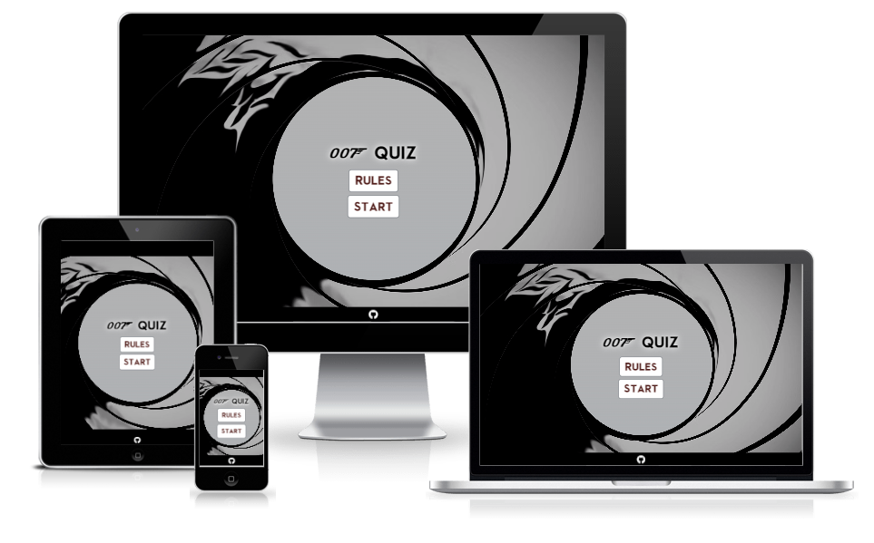

<b>[View live website here](https://alexkisielewicz.github.io/quiz-game/)</b> :computer:

This is James Bond Quiz Game created as Portfolio Project #2 (JavaScript Essentials) for Diploma in Full Stack Software Development at [Code Institute](https://www.codeinstitute.net).   It is an interactife front-end quiz app where user can test their knowledge about James Bond films. The application is responsive across a range of devices and it is easy to use for the user. 

Project purpose is presentation of interactive data. The site should respond to the users actions allowing user to actively engage with data, alter the way the site displays the information to achieve their preferred goals.

 

# Table of content 

*   [Project](#project)
    *   [Strategy/Scope](#strategyscope)
    *   [Site owner goals](#site-owner-goals)
    *   [Site user goals](#user-goals)
*   [User Experience (UX/UI)](#user-experience-ux)
    *   [Color Scheme](#colour-scheme)
    *   [Typography](#typography)
    *   [Structure](#structure)
*   [Technology](#technology)
    *   [Languages used](#languages-used)
    *   [Frameworks, libraries & software used](#languages-used)
*   [Testing](#testing)
    *   [Accessibility](#accessibility)
    *   [Performance](#performance)
    *   [Validation](#validation)
    *   [HTML](#html)
    *   [CSS](#css)
    *   [JavaScript](#javascript)
    *   [Browser compatibility](#browser-compatibility)
    *   [Platforms/devices](#platformsdevices)
    *   [Bugs/known issues](#bugsknown-issues)
    *   [Responsiveness](#responsiveness)
*   [Deployment](#deployment)
*   [Credits](#credits)
    *   [Code](#code)
    *   [Media](#media)
    *   [Acknowledgements](#acknowledgements)

#   Project
##  Strategy/Scope

Yoga Studio website aims to provide essential information about the studio and its offer to the user in a clear and visually pleasing way. It targets people who are looking for information about yoga and want to join local club or start learning yoga on-line. 
 

 The content is presented on scrolling page with sections dedicated to categorised informations. The <b>primary objective</b> is to find new studio members by leading them to classes booking form. With this in mind website highlights studio key points and presents yoga catagories to help users determine which is the right fit for them. <b>The secondary objective</b> is to provide on-line learning resources, giving user a choice between basic and advanced techniques.  
 
To achieve the strategy goals I implemented following features:
* simple website layout with a menu bar sticked to the top of the viewport for easy navigation,  
* a carousel with caption images and call-to-action buttons forwarding user to relevant sections,
* imformative "About" and "Learn" sections, 
* multiple call-to-action buttons across the whole page,  
* "Sign-in!" section with booking form providing feedback on submission,    
* consistent images across the whole page to immerse the user in Site Owner's story. 
 

## Site owner goals

- to promote Yoga Studio in the local area by offering in-studio classes and on-line by providing learning resources, 
- to provide important information about Yoga Studio, such as: business background, offered classes, classes timetable, instructors silhouettes, contact information, address, opening times, social media profiles,  
- to provide multimedia showing the studio,  
- to provide booking form for the users allowing them to join the club and starting yoga activities,    
- provide image gallery with photos from the studio to promote yoga and encourage new people to join, 
- provide social meddia links to obtain new followers who become part of Yoga Studio community, 
- to provide website that looks well across a range of devices (responsiveness).  

##  User goals

- as a new user I want to:
    - navigate easily through the page, 
    - learn more about yoga, 
    - find information about Yoga Studio and it's offer, 
    - check classes timetable, 
    - check opening times,
    - check the photos from the studio to find out what's the "vibe" in there,  
    - book my classes/join the studio 
    - find out who teaches yoga, 
    - learn yoga techniques by watching tutorials, 
    - contact Yoga Studio, 
    - check address, get directions to Studio, 
    - follow Yoga Studio on social media, 

     

- as a returning user I want to:
    -   navigate easily through the page, 
    -   check classes timetable,
    -   check opening times,  
    -   book yoga classes, 
    -   watch on-line yoga lessons,  
    -   contact Yoga Studio,
    -   get directions to Yoga Studio
    -   see the pictures from yoga sessions. 

 

#   User Experience (UX)

##  Colour Scheme

Colour palette was selected using <b>coolors.co</b> generator and has been extracted from the frame comming from the film "Skyfall". The number of colours used has been reduced as there was no need for all of them.

For best readability and clean look white colour was chosen for the bacgkround of the quiz-rules and the buttons, hex colour #51301C was chosen for the text. I chose "gold #FFD700" colour for hover effect for the buttons on the start screen and user interface elements such as progress bar, question counter, audio controls and score counter. Light gray colour was selected as a background that fills "the barrel". Depending on the answer, user is given a feedback for correct and incorrect answer. Barrel background colour changes colour to green and red respectively. Also correct and incorrect answers are highlited in the same style to provide visual feedback.  

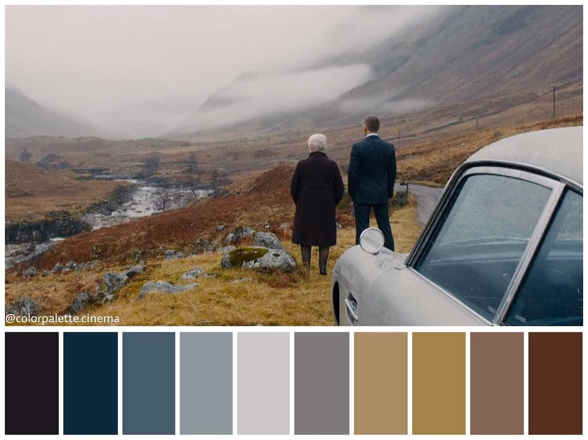

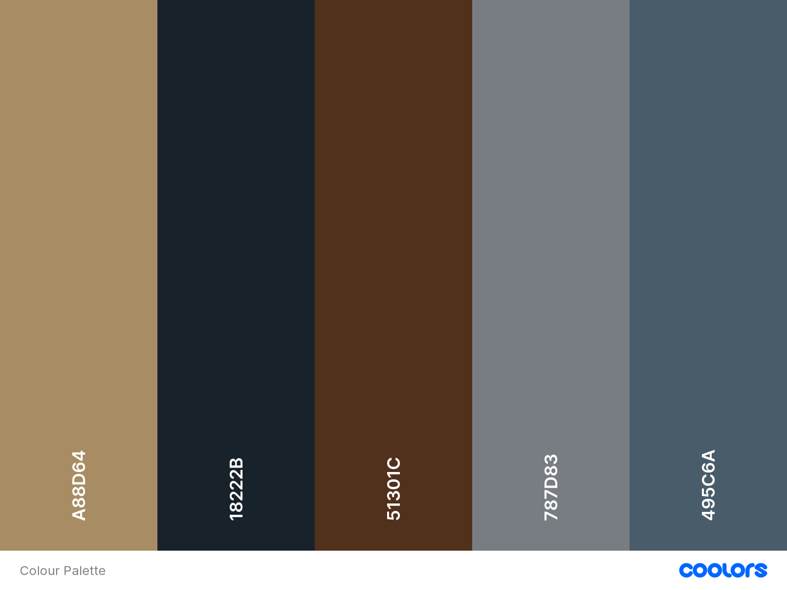

 

##  Typography

-   The <b>Merriweather</b> font is the font used throughout the whole website with Serif as the fallback. The Merriweather is a clean, modern looking font and is attractive. It is sourced from [Google fonts](https://fonts.google.com/specimen/Merriweather) and it's linked to css document via @import. 

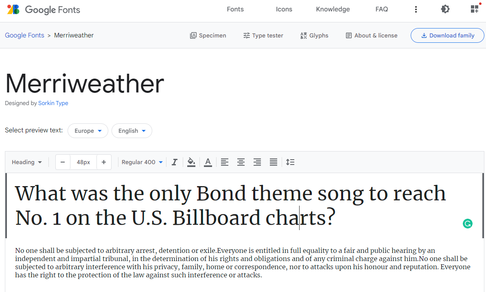

-   <b>Skyfall Done</b> is another font used in the project. It's style has been used in the graphics related to "Skyfall" Bond film and it's associated with recent films from the Bond series. It is sourced from [Cufonfonts.com](https://www.cufonfonts.com/font/skyfall-done) and it's served to the html document remotely from web server as The Web Open Font Format (WOFF) via @font-face CSS rule.
The font is used on the quiz main screen (the header and the buttons) and also at the end of the quiz on score page and 404 page.   

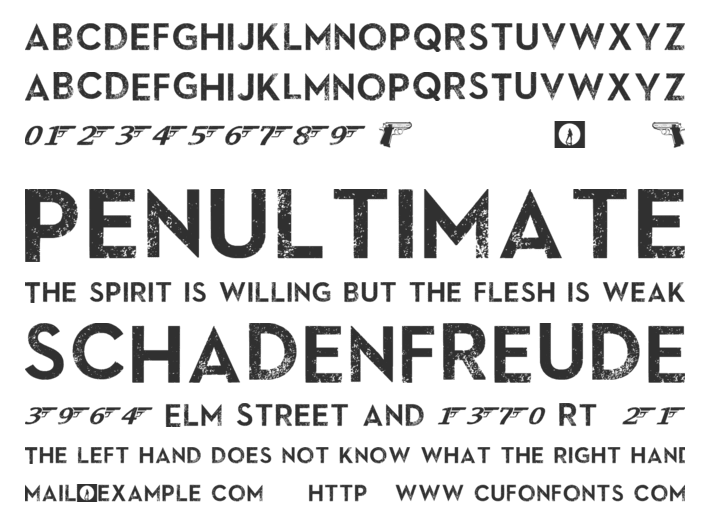

 

##  Structure

### Wireframes - [View all wireframes - PDF file](https://github.com/alexkisielewicz/Portfolio-Project-1/tree/main/docs/yoga_studio_portfolio_project_1.pdf)

Page is designed in well known scrolling page style that users like. It provides fast access to information and immerses user in the story. Navigation bar is always visible in the viewport, that reduces number of clicks to reach desirable content. Website consists of following sections: 

## Start screen 

One of the most recognizable and iconic elements of Bond films is gun barrel intro sequence. That kind of barrel was chosen to be a background for all pages throughout the application. The main content is presented in the center of the barrel opening which is also center of the viewport. The .png file has been used so the center of the barrel could be tranparent and show background that changes during the game depending on user actions.  

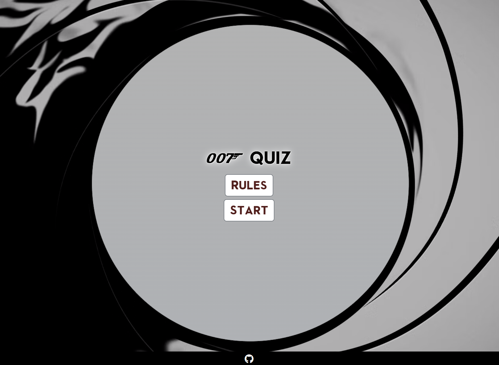

Start screen presents to the user Quiz logo and two buttons; RULES and START. User can learn easy to follow quiz rules after clicking on the RULES button. The game starts after clicking on START button. James Bond Theme Song starts to play in the background.  

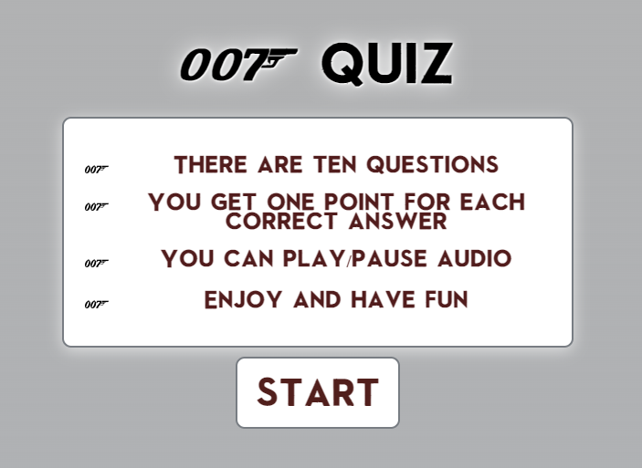

## Controls

Start screen buttons and logo become hidden and interface reveals informative controls section where user can track their progress and pause/play theme song.   

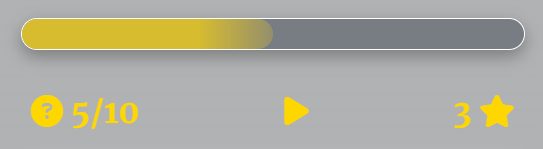

## Question 

Interface displays 10 randomly selected questions with four answer options. 

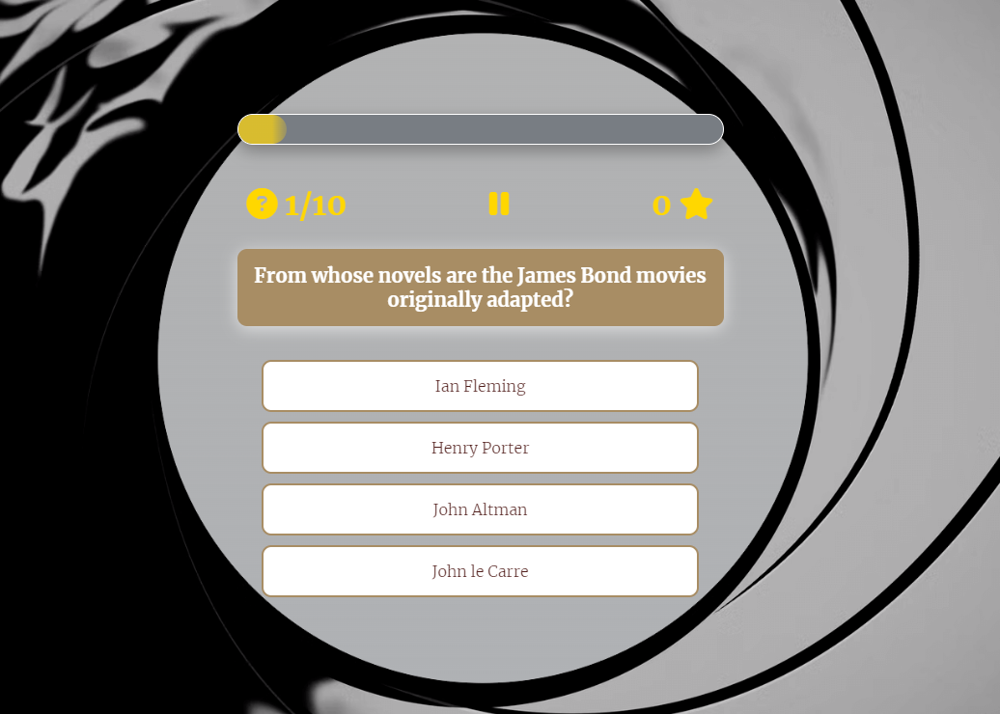

## Visual and audio feedback for correct and incorrect answer

There is a feedback provided to the user when answer is given. Depending on correct or incorrect answer, the opening of the barrel changes colour respectively to green and red. There is an "agent" image presented in the center of the screen in case of correct answer and blood stains in case of incorrect answer. The correct and incorrect answers are also highlited and audio feedback is played. The volume of Bond Theme Song is decresed by default to value 0.4 in JavaScript, this allows user to hear answer audio feedback much clearer. 

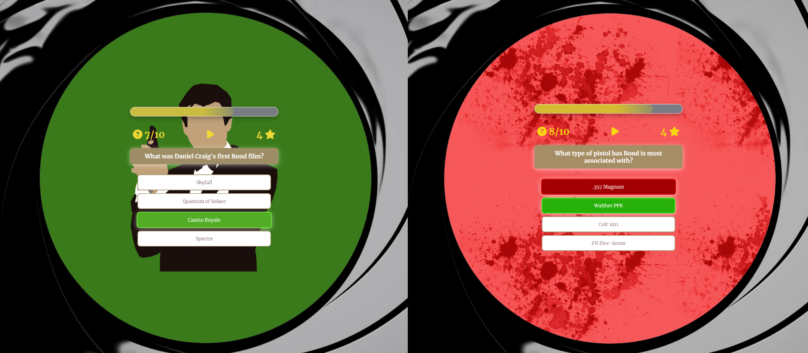

## Footer

 Simple, nondistracting footer at the bottom of the screen is incorporated in black bar resembling films black bars. It contains only one item - GitHub icon with link leading to project repository.  

## Score page

DESCRIPTION PLACEHOLDER

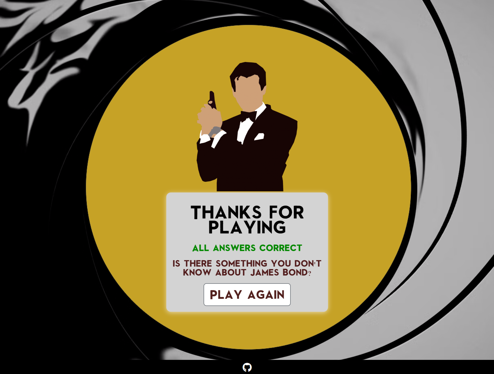

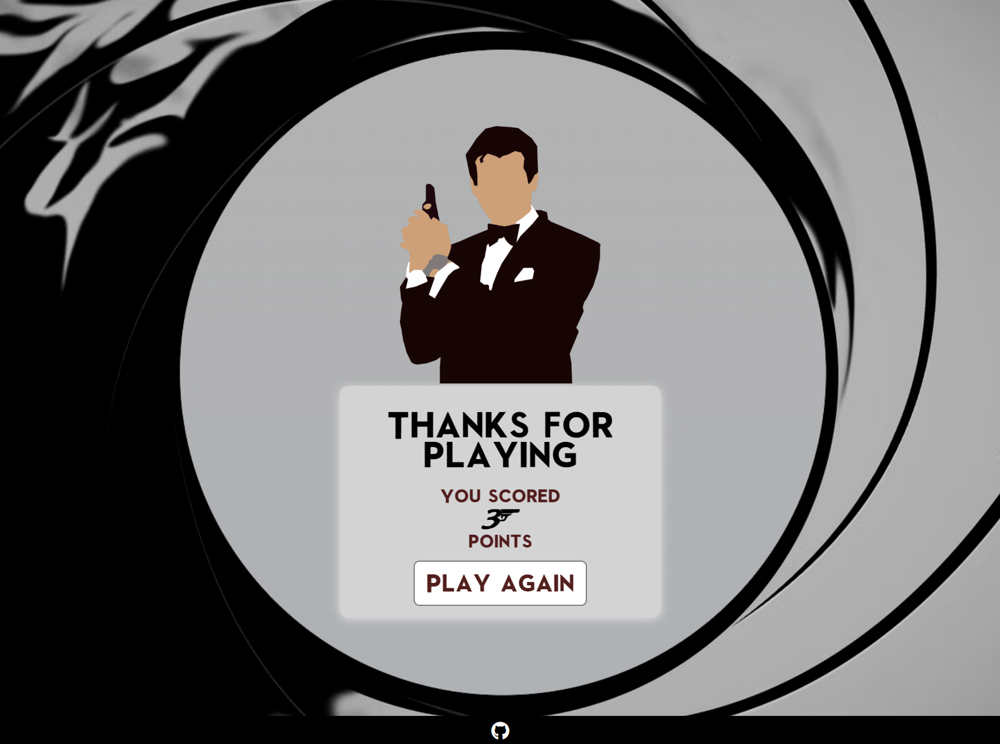

## HTTP 404 Page
An error page in case that user tries to open a website that cannot be found on the web server. User doesn't have to use browser "go back" button, the link to the main page is provided.

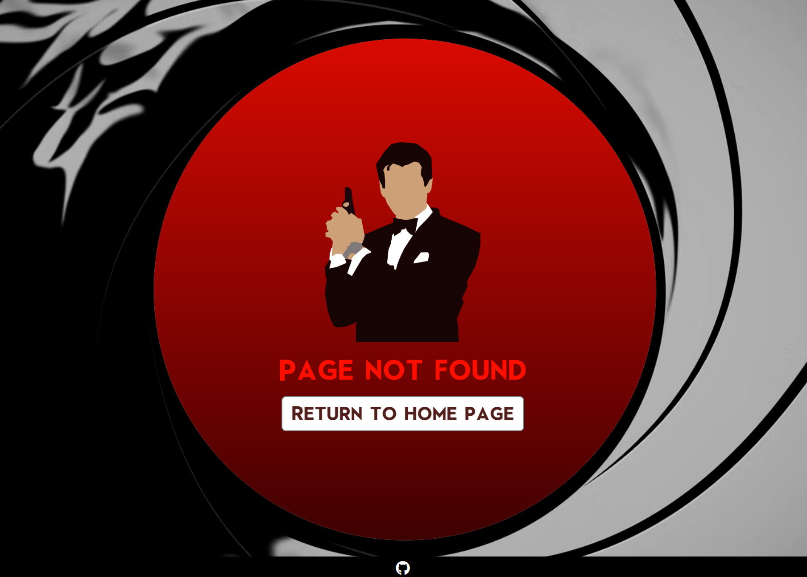

#   [Technology](#technology)
    
##  [Languages used](#languages-used)

-   [HTML5](https://en.wikipedia.org/wiki/HTML5)
-   [CSS3](https://en.wikipedia.org/wiki/Cascading_Style_Sheets)
-   [JavaScript](https://en.wikipedia.org/wiki/JavaScript)
-   [Markdown](https://en.wikipedia.org/wiki/Markdown) - markup language used to write this document.
    
##  [Frameworks, libraries & software used](#languages-used)

- [Balsamiq](https://balsamiq.com/) - Balsamiq was used to create the [wireframes](#structure) during the design process.

- [Coolors.co](https://coolors.co/) - was used to create color palette. 

- [Google Fonts](https://fonts.google.com/specimen/Merriweather) - Google fonts were used to import the 'Merriweather' font into the style.css file which is used on all pages throughout the project.

- [Font Awesome:](https://fontawesome.com/) - Font Awesome was used on all pages throughout the website to add icons for aesthetic and UX purposes.

- [Git](https://git-scm.com/) - Git was used for version control by utilizing the Gitpod terminal to commit to Git and Push to GitHub.

- [GitHub](https://github.com/) - GitHub is used to store the project's code after being pushed from Git.

- [GitPod](https://www.gitpod.io) and [Visual Studio Code for Windows](https://code.visualstudio.com/) - IDE used to code the project. 

- [Adobe Photoshop](https://www.adobe.com/ie/products/photoshop.html) - Photoshop was used to resize and crop the pictures. 

- [Audioeye.com](https://www.audioeye.com/color-contrast-checker) - used to analyse text/background contrast. 

- [TinyPNG](https://tinypng.com/) - used for png files compression.

- [Convertio.co](https://convertio.co/jpg-webp/) - used to convert images to next-gen *.webp format  

- [Free Formatter](https://www.freeformatter.com/) - used for formatting html and css documents for optimal readability.  

- [Am I Responsive](https://ui.dev/amiresponsive) - online tool used to create mockup to present responsive design of this project. 

- [Lightshot](https://app.prntscr.com/) - Google Chrome extension used to capture screenshots for this README document. 

- [Lighthouse](https://developers.google.com/web) - Google WebDev tool used for performance/accesibility testing.  

- [Wave Web Accessibility Evaluation Tool](https://wave.webaim.org/) - used to test accessibility of the webpage. 

- [Favicon.io](https://www.favicon.io) - tool used to create favicon. 

 

#    Testing

##   Accessibility

Foreground and background color contrast check was done using [Audioeye.com](http://www.audioeye.com) online tool.

 

 

[WAVE](https://wave.webaim.org/) Web Accessibility Evaluation Tool was used to check accessibility. It reported one error "Missing alternative text". It is related to carousel background photo linked via CSS stylesheet. Alternative text cannot be set in this case. Four alerts are minor and related to justified text in the paragraphs. 

##   Performance

 [Lighthouse](https://developers.google.com/web) - Google webdev tool used for performance testing.  

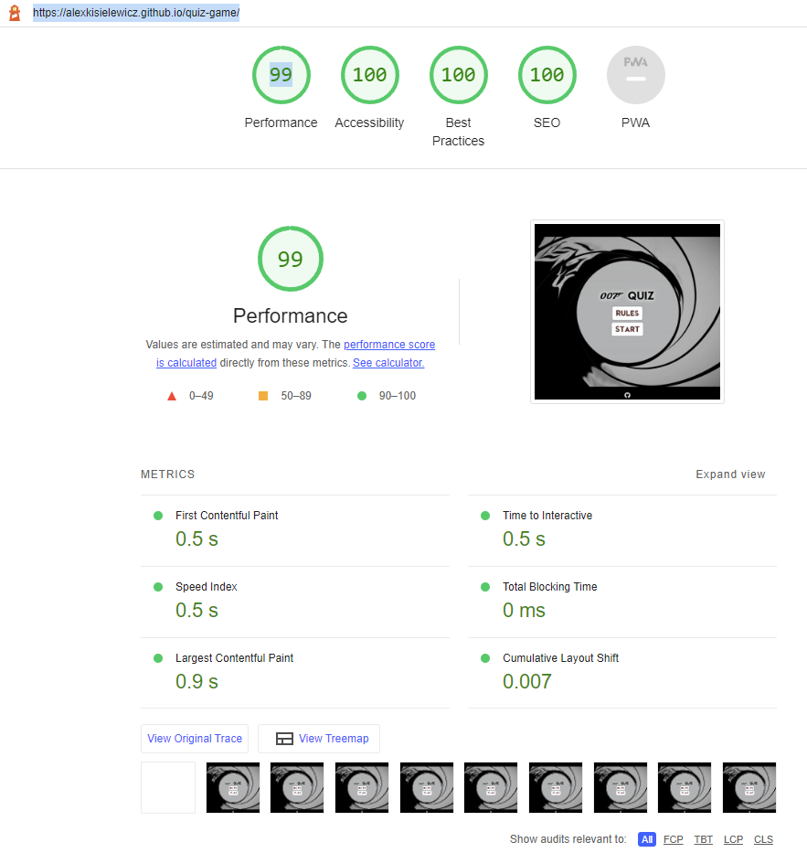

##   Validation

###   HTML

- [W3C Markup Validator](https://validator.w3.org/nu/) - validation service used. 

:x: index.html - first result found 2 errors that refer to unclosed element and missing open element.  
Three warnings refer to lack of heading in sections such as Gallery, YouTube video or Google Map and also recommend using h2-h6 headers instead of h1 used in Carousel caption.  

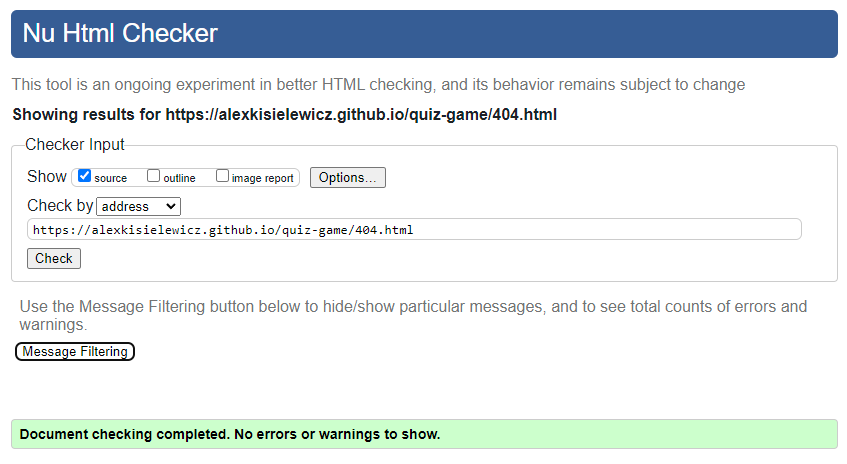
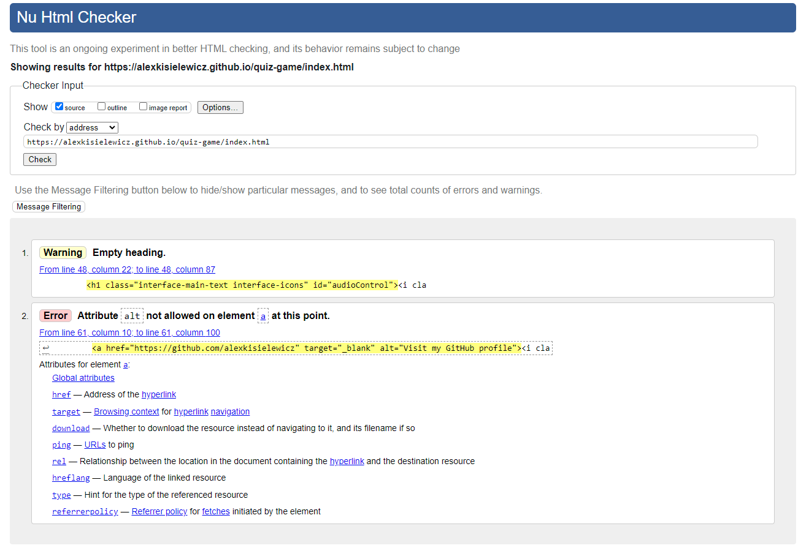
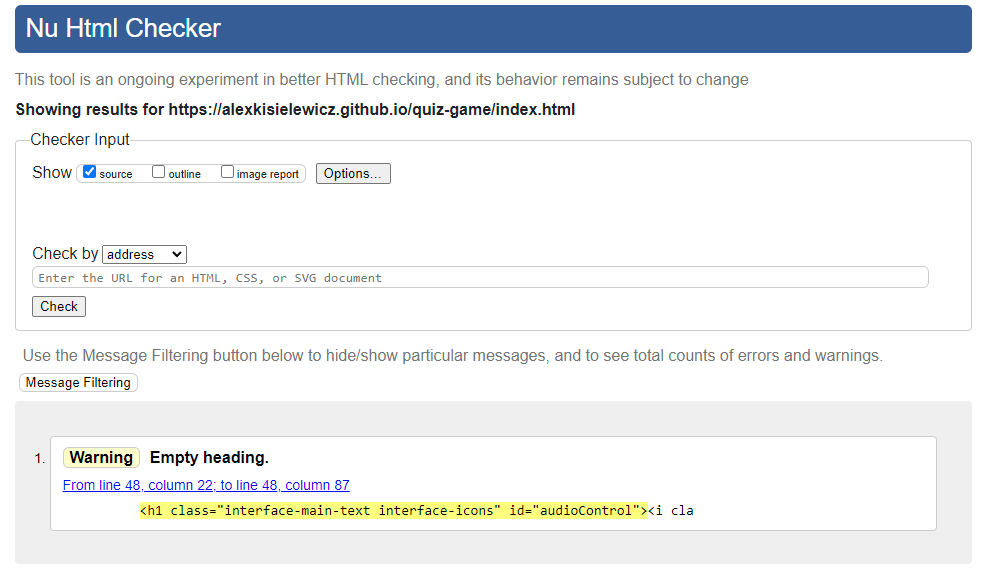

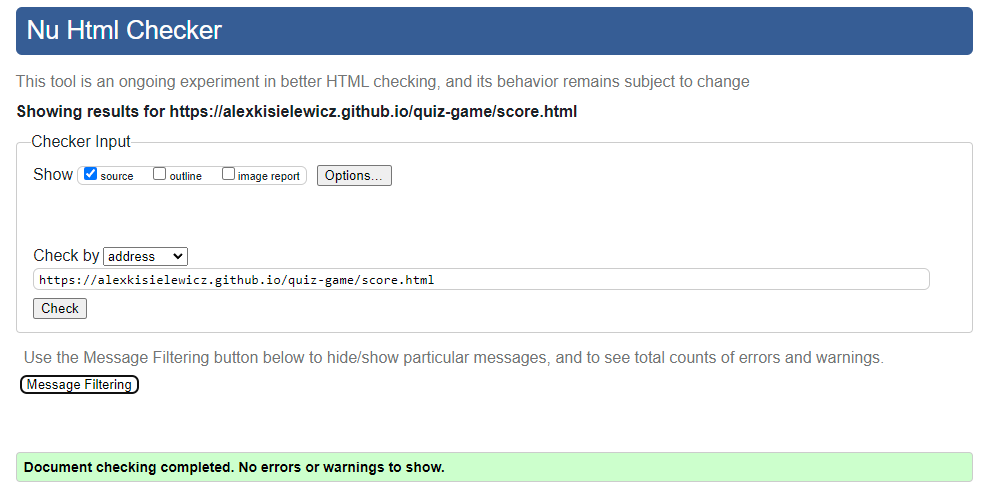

:heavy_check_mark: index.html - after error fixes, final result: 

Result for 404.html page :heavy_check_mark:
 

Result for thankyou.html page :heavy_check_mark:
 

###   CSS

- [W3C CSS Validator](https://jigsaw.w3.org/css-validator/#validate_by_input)  - validation service used. 

- [Custom stylesheet](https://jigsaw.w3.org/css-validator/validator?uri=https%3A%2F%2Falexkisielewicz.github.io%2FPortfolio-Project-1%2Fassets%2Fcss%2Fstyle.css&profile=css3svg&usermedium=all&warning=1&vextwarning=&lang=en-EN) -  No Error Found. :heavy_check_mark: 

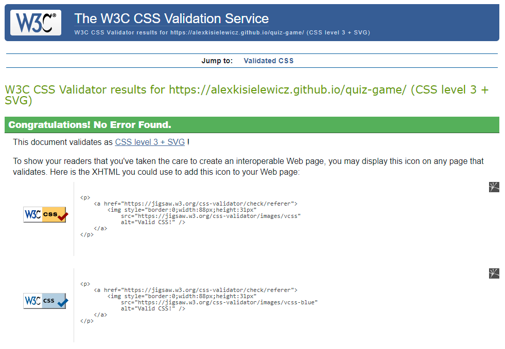

### JavaScript 

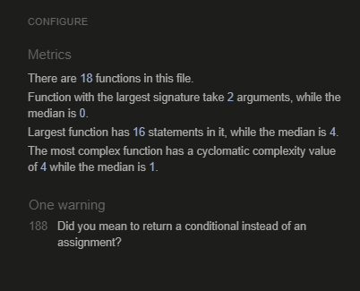

##   Browser compatibility

Website was tested manually on following browsers: Google Chrome, Edge, Firefox, Safari, Brave. The results were satisfactory.   

##   Platforms/devices 

Website was tested manually on Apple Iphone X, Apple iPad, Apple Macbook Air, Samsung Galaxy Tab S7+, Ultrawide display 3440x1440 and classic 16:9 2560x1440 display. The results were satisfactory.  

## Responsiveness 

I confirmed that this website is responsive and all the functions are displayed correctly and booking booking form work fine.   

##   Bugs/known issues

// Issues:
// - choices stays selected on touch devices (can see it in DevTools too)
// - max possible score is 9 instead of 10 
// - no delay to see if the last 10th question was answered correctly
// - clicking should be disabled after choice is clicked

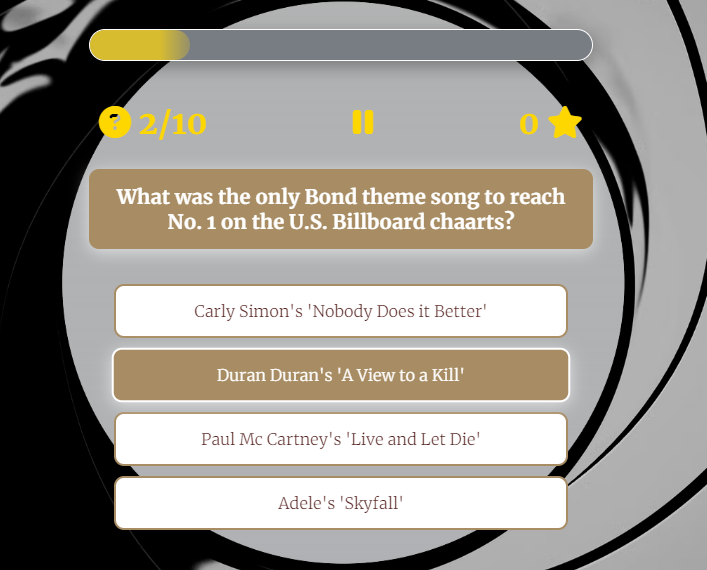
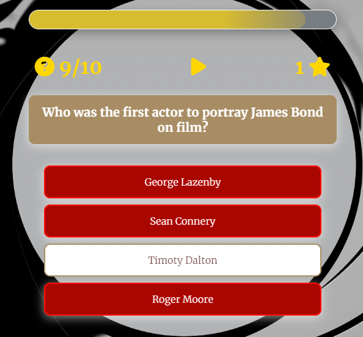

#   Deployment
    
The project was deployed to GitHub Pages using the following steps:  

1. Log in to GitHub and locate the [quiz-game](https://github.com/alexkisielewicz/quiz-game) repository. 
2. Locate the "Settings" Button on the menu.
3. Scroll down the Settings page until you locate the "Pages" in "Code and automation" section.
4. Under "Source", click the dropdown called "Select branch:" and select "Main", click the dropdown called "Select folder" and select "/root".
5. The page will automatically refresh and you receive message "Your site is published at https://alexkisielewicz.github.io/quiz-game/". Result below: 

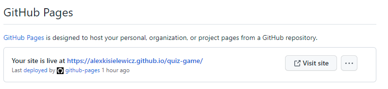

 

#   Credits

##  Code
-   [StackOverflow](https://stackoverflow.com/questions/27053633/how-to-make-an-array-of-audio-files-randomly-in-javascript) - the method to shuffle array and get random index. Used to get random audio files and questions from the arrays.
-   Mentor - Reuben Ferrante helped me finding solution for choices buttons, that were still clickable after user selected one choice. He edited the code with first "if" conditional - code in the file script.js starts at line 235. He also added function that loops through the buttons and check if they are selected. Depends on their state it adds or removes "disable" attribute. Code in the file script.js starts at line 214.

##  Media

-   All images used were sourced from free stock images [StickPNG.com](https://www.stickpng.com/)
-   [Icons8.com](https://icons8.com/) - source of favicon image
-   Quiz questions were sourced from: 
    * [Entertainment.ie](https://entertainment.ie/movies/movie-news/17-quiz-questions-about-james-bond-457692/)
    * [UltimateQuizQuestions.com](https://www.ultimatequizquestions.com/james-bond-quiz/)
    * [Metro.co.uk](https://metro.co.uk/2021/09/30/james-bond-27-pub-quiz-questions-to-test-your-007-knowledge-15340805/)
-   James Bond Theme Song was sourced from: [Archive.org](https://archive.org/details/tvtunes_6995)
-   Audio files used as feedback for correct and incorrect answer were sourced from: 
    * [Tuna.voicemod.net](https://tuna.voicemod.net/search?search=bond)
    * [Soundboard.com](https://www.soundboard.com/sb/jamesbond)
    * [Voicy.network](https://www.voicy.network/)

## Learning resources

- [Code Institute course and learning platform](https://codeinstitute.net/)
- [The book "JavaScript: The Definitive Guide, 7th Edition](https://www.oreilly.com/library/view/javascript-the-definitive/9781491952016/)
- [StackOverflow](https://stackoverflow.com/)
- [W3Schools](https://www.w3schools.com/js/default.asp)
- [Lage.us](https://lage.us/Javascript-Pass-Variables-to-Another-Page.html) - I learned how to pass variable to another page

##  Acknowledgements

-   My Mentor Reuben Ferrante for helpful feedback and guidance at all stages of the project. 
-   Code Institute Slack Community for being invaluable knoledge base.    

## Disclaimer
-   James Bond Quiz Game was created for educational purpose only. 