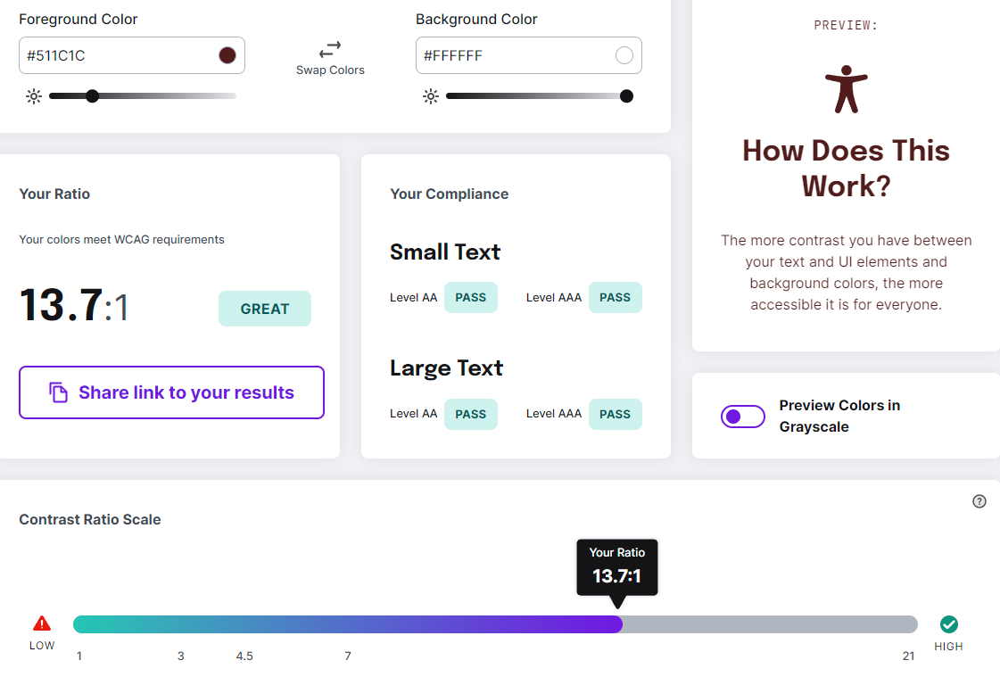
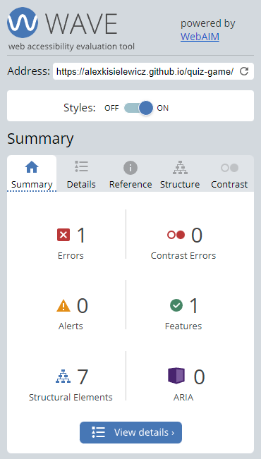
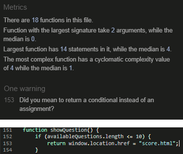
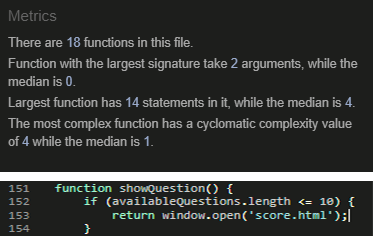
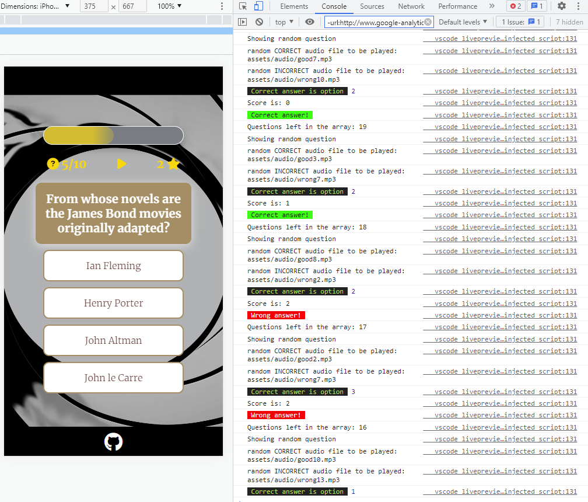
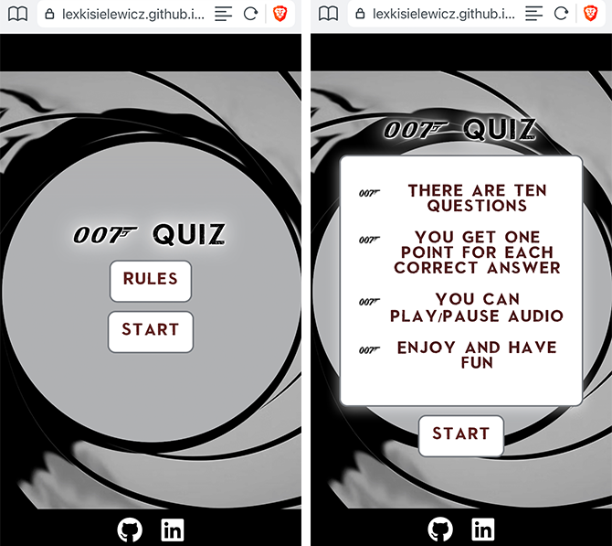
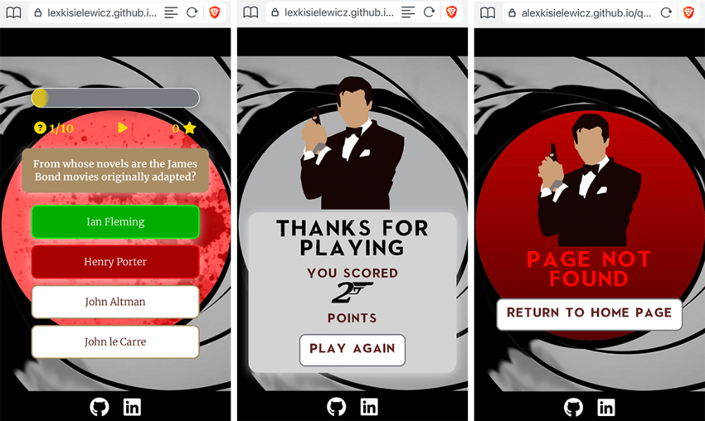
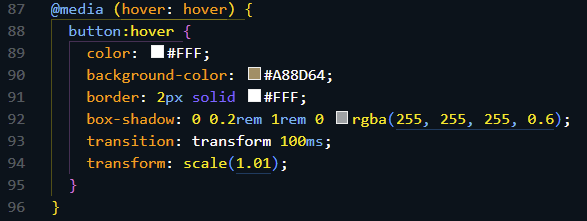
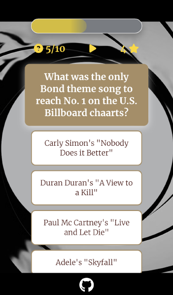

<h1 align="center">James Bond Quiz Game - JavaScript</h1>

### Developer: Aleksander Kisielewicz

<b>[View live website here](https://alexkisielewicz.github.io/quiz-game/)</b> :computer:

This is James Bond Quiz Game created as Portfolio Project #2 (JavaScript Essentials) for Diploma in Full Stack Software Development at [Code Institute](https://www.codeinstitute.net).   It is an interactife front-end quiz app where user can test their knowledge about James Bond films. The application is easy to use for the user, it is responsive across a range of devices and incorporates best practices regarding design and accesibility. 

Project purpose is presentation of interactive data. The site should respond to the users actions allowing user to actively engage with data, alter the way the site displays the information to achieve their preferred goals. 

 

# Table of content 

*   [Project](#project)
    *   [Strategy/Scope](#strategyscope)
    *   [Site owner goals](#site-owner-goals)
    *   [Site user goals](#user-goals)
*   [User Experience (UX/UI)](#user-experience-ux)
    *   [Colour Scheme](#colour-scheme)
    *   [Typography](#typography)
    *   [Structure](#structure)
*   [Technology](#technology)
    *   [Languages used](#languages-used)
    *   [Frameworks, libraries & software used](#languages-used)
*   [Testing](#testing)
    *   [Accessibility](#accessibility)
    *   [Performance](#performance)
    *   [Validation](#validation)
    *   [HTML](#html)
    *   [CSS](#css)
    *   [JavaScript](#javascript)
    *   [Browser compatibility](#browser-compatibility)
    *   [Platforms/devices](#platformsdevices)
    *   [Bugs/known issues](#bugsknown-issues)
    *   [Responsiveness](#responsiveness)
    *   [Peer review](#peer-review)
*   [Deployment](#deployment)
*   [Credits](#credits)
    *   [Code](#code)
    *   [Media](#media)
    *   [Acknowledgements](#acknowledgements)

#   Project
##  Strategy/Scope

James Bond Quiz Game is an entertainment app intended for James Bond fans or other users who want to test their knowledge about James Bond's universe. The quiz contains question with various difficulty level, that encourages user to replay the game if he doesn't achieve maximum score in the first run.
 

 The content is presented on single page that interactively changes content depending on user actions. The <b>primary goal</b> is to entertain user during the game. With this in mind website's desing provides mixture of interactive elements, both visual and sound. <b>The secondary objective</b> is to improve user's knowledge about James Bond universe. With this in mind, the app provides user a feedback after each answer.

To achieve the strategy goals I implemented following features:

* simple website layout with the content located in the center of the viewport,
* buttons easy to click both on computers and mobile touch interfaces,
* plain and simple game rules,
* intuitive game interface that presents important informations and controls in a clear way,
* visual and sound feedback to user actions,
* funny sound effects and eye-pleasing graphics to make the experience entertaining.
 

## Site owner goals

- provide entertaining and interactive experience for the user,
- provide game app with questions with various difficulty level,
- provide a link to linkedIn and the project's GitHub repository, to interest user in the project and to obtain new followers,
- to provide website that looks well across a range of devices (responsiveness).  

##  User goals

- as a user I want to:
    - navigate easily through the page,
    - understand the rules of the game,
    - see clean interface and be able to track progress/score,
    - know how many questions I have left to answer,
    - receive feedback for given answers,
    - play/pause audio
    - learn something new about James Bond universe,
    - enjoy the game,
    - see my score after I answer the last question,
    - be able to re-play the game without using "back" button in the browser
    - follow the developer in social media

#   User Experience (UX)

##  Colour Scheme

Colour palette was selected using <b>coolors.co</b> generator and has been extracted from the frame comming from the film "Skyfall". The number of colours used has been reduced as there was no need for all of them.

For best readability and clean look white colour was chosen for the bacgkround of the quiz-rules and the buttons, hex colour #51301C was chosen for the text. I chose "gold #FFD700" colour for hover effect for the buttons on the start screen and user interface elements such as progress bar, question counter, audio controls and score counter. Light gray colour and linear gradient was selected as a background that fills "the barrel". Depending on the answer, user is given a feedback for correct/incorrect answer. Barrel background colour changes colour to green and red respectively. Also correct and incorrect answers are highlited in the same colour style to provide visual feedback.  

 

##  Typography

-   The <b>Merriweather</b> font is the font used throughout the whole website with Serif as the fallback. The Merriweather is a clean, modern looking font and is attractive. It is sourced from [Google fonts](https://fonts.google.com/specimen/Merriweather) and it's linked to CSS document via @import.

-   <b>Skyfall Done</b> is another font used in the project. It's style has been used in the graphics related to "Skyfall" Bond film and it's associated with recent films from the Bond series. It is sourced from [Cufonfonts.com](https://www.cufonfonts.com/font/skyfall-done) and it's served to the html document remotely from web server as The Web Open Font Format (WOFF) via @font-face CSS rule.
The font is used on the quiz main screen (the header and the buttons) and also at the end of the quiz on score page and 404 page.

 

##  Structure

### Wireframes - [View all wireframes - PDF file](https://github.com/alexkisielewicz/quiz-game/tree/main/docs/wireframes_pp2.pdf)

Page is designed in very simple way. All pages display gun barell and the content is located in it's opening in the center of the screen. The content is changed dynamicaly by JavaScript manipulating DOM.

## Start screen

One of the most recognizable and iconic elements of Bond films is gun barrel intro sequence. That kind of barrel was chosen to be a background for all pages throughout the application. The main content is presented in the center of the barrel opening which is also center of the viewport. The .png file has been used so the center of the barrel could be tranparent and show background that changes during the game depending on user actions.  

Start screen presents to the user quiz logo and two buttons; RULES and START. User can learn easy to follow game rules after clicking on the RULES button. The game starts after clicking on START button. James Bond Theme Song starts to play in the background, the autoplay function is not used as it is not recommended by industry standards.

## Controls

Start screen buttons and logo become hidden and interface reveals informative controls section where user can track their progress and pause/play theme song.

## Question

Interface displays 10 randomly selected questions (from 20 available). Each question has 4 answer choices and only one is correct. The next question is automatically showed when user select the answer. 

## Visual and audio feedback for correct and incorrect answer

There is a feedback provided to the user when answer is given. Depending on correct or incorrect answer, the opening of the barrel changes colour respectively to green or red. There is an "agent" image presented in the center of the screen in case of correct answer and blood stains in case of incorrect answer. The correct and incorrect answers are also highlited and audio feedback is played. The volume of Bond Theme Song is decresed to value 0.4 (1.0 is default) in JavaScript, this allows user to hear answer audio feedback much clearer.

## Footer

 Simple, nondistracting footer at the bottom of the screen is incorporated in black bar resembling films black bars. It contains only one item - GitHub icon with link leading to project repository. <b>LinkedIn</b> icon and link has been added in the development process.

## Score page

Score page is displayed automatically after user answers the last tenth question. There are two kinds of score page messages. If user achieve maximum score of ten points - page with gold background is displayed. If user's score is other than 10 points, the second message is displayed. In both cases user can click  "play again" button to start new game without using "back" button in the browser.

## HTTP 404 Page
An error page is displayed in case that user tries to open a website that cannot be found on the web server. User doesn't have to use browser "go back" button, the link to the main page is provided.

#   [Technology](#technology)
    
##  [Languages used](#languages-used)

-   [HTML5](https://en.wikipedia.org/wiki/HTML5)
-   [CSS3](https://en.wikipedia.org/wiki/Cascading_Style_Sheets)
-   [JavaScript](https://en.wikipedia.org/wiki/JavaScript)
-   [Markdown](https://en.wikipedia.org/wiki/Markdown) - markup language used to write this document.
    
##  [Frameworks, libraries & software used](#languages-used)

- [Balsamiq](https://balsamiq.com/) - Balsamiq was used to create the [wireframes](#structure) during the design process.

- [Coolors.co](https://coolors.co/) - was used to create colour palette.

- [Google Fonts](https://fonts.google.com/specimen/Merriweather) - Google fonts were used to import the 'Merriweather' font into the style.css file which is used on all pages throughout the project.

- [Font Awesome:](https://fontawesome.com/) - Font Awesome was used on all pages throughout the website to add icons for aesthetic and UX purposes.

- [Git](https://git-scm.com/) - Git was used for version control by utilizing the Gitpod terminal to commit to Git and Push to GitHub.

- [GitHub](https://github.com/) - GitHub is used to store the project's code after being pushed from Git.

- [GitPod](https://www.gitpod.io) and [Visual Studio Code for Windows](https://code.visualstudio.com/) - IDE used to code the project.

- [Adobe Photoshop](https://www.adobe.com/ie/products/photoshop.html) - Photoshop was used to resize and crop the pictures.

- [Audioeye.com](https://www.audioeye.com/color-contrast-checker) - used to analyse text/background contrast.

- [TinyPNG](https://tinypng.com/) - used for png files compression.

- [Convertio.co](https://convertio.co/jpg-webp/) - used to convert images to next-gen *.webp format  

- [Free Formatter](https://www.freeformatter.com/) - used for formatting html and css documents for optimal readability.  

- [Am I Responsive](https://ui.dev/amiresponsive) - online tool used to create mockup to present responsive design of this project.

- [Lightshot](https://app.prntscr.com/) - Google Chrome extension used to capture screenshots for this README document.

- [Lighthouse](https://developers.google.com/web) - Google WebDev tool used for performance/accesibility testing.  

- [Wave Web Accessibility Evaluation Tool](https://wave.webaim.org/) - used to test accessibility of the webpage.

- [Favicon.io](https://www.favicon.io) - tool used to create favicon.

#    Testing

##   Accessibility

Foreground and background colour contrast check was done using [Audioeye.com](http://www.audioeye.com) online tool.

[WAVE](https://wave.webaim.org/) Web Accessibility Evaluation Tool was used to check accessibility. It reported one error "Missing h1 text". h1 tag is used as placeholder for play/pause button to control audio playback. The DOM is queried by JavaScript and it inserts font awesome in this place. It is marked as a warning in HTML validator, not an error.

##   Performance

 [Lighthouse](https://developers.google.com/web) - Google webdev tool used for performance testing showing near-maximum score.

## Validation

### HTML

- [W3C Markup Validator](https://validator.w3.org/nu/) - validation service used.

:x: index.html - first test found 1 error that refer to attribute "alt" used with anchor element. The issue was fixed by changing this attribute to "title". One warning refer to empty heading. It was also found by WAVE accesibility tool - [click for description](#accessibility). Header is used as placeholder for font-awesome icon and manipulated by JavaScript.

:heavy_check_mark: index.html - after fixing above error.

Result for gameresult.html page :heavy_check_mark:

Result for 404.html page :heavy_check_mark:

### CSS

- [W3C CSS Validator](https://jigsaw.w3.org/css-validator/#validate_by_input)  - validation service used.

No Error Found. :heavy_check_mark:

### JavaScript 

- [JS Hint](https://jshint.com/) - validation service used.

:heavy_check_mark: JS Hint didn't find any errors, there was one warning for the functions used in line 153. The issue was fixed by changing <i>window.location.href</i> property to <i>window.open()</i> method. Solution was found on [StackOverflow](https://stackoverflow.com/questions/7077770/window-location-href-and-window-open-methods-in-javascript).

Screnshoot before fix:

Screnshoot after fix:

- Application was tested manually for bugs and errors during throught development process. All console.log messages have been removed before app release.

##   Browser compatibility

Website was tested manually on following browsers: Google Chrome, Edge, Firefox, Safari, Brave. The results were satisfactory on all browsers. 

##   Platforms/devices

Website was tested manually on Apple Iphone X, Apple iPad, Apple Macbook Air, Samsung Galaxy Tab S7+, Ultrawide display 3440x1440 and classic 16:9 2560x1440 display. The results were satisfactory and proved good responsiveness on all screen sizes.

## Responsiveness

I confirmed that this website is responsive and all the functions are displayed correctly.

## Peer review

I asked my friends and CI coleagues to test the application and I received a lot of positive feedback, no issues were reported. Thanks to the feedback I implemented function that shows the correct answer when user chose wrong answer, I didn't plan to use this function at planning stage.

##   Bugs/known issues

- <b>Issue #1:</b>  Hover state of the button stays active after button is clicked and dosn't come back to normal state. Issue is present only on touch devices. 

<b>Solution:</b> [StackOverflow](https://stackoverflow.com/questions/23885255/how-to-remove-ignore-hover-css-style-on-touch-devices)

Pseudo-class .button:hover was replaced with CSS at rule below: 

- <b>Issue #2:</b> Answer buttons are not disabled for clicking after user select one answer. This lets user to click multiple times on other buttons before correct/incorrect feedback is displayed. 

<b>Solution: </b> My Mentor - Reuben Ferrante edited the code adding "if" statement (code in the file script.js starts at line 235) and using the loop function to go through all 4 buttons and check if they are clicked. Depends on their state the function adds or removes "disable" attribute (Code in the file script.js starts at line 214).

- <b>Issue #3:</b> The last answer option button doesn't fit to the screen on small devices below 576px wide.

<b>Solution:</b> padding of button element and margin of game container have been adjusted to fit the screen.

#   Deployment

The project was deployed to GitHub Pages using the following steps:  

1. Log in to GitHub and locate the [quiz-game](https://github.com/alexkisielewicz/quiz-game) repository. 
2. Locate the "Settings" Button on the menu.
3. Scroll down the Settings page until you locate the "Pages" in "Code and automation" section.
4. Under "Source", click the dropdown called "Select branch:" and select "Main", click the dropdown called "Select folder" and select "/root".
5. The page will automatically refresh and you receive message "Your site is published at https://alexkisielewicz.github.io/quiz-game/". Result below: 

 

#   Credits

##  Code
-   [StackOverflow](https://stackoverflow.com/questions/27053633/how-to-make-an-array-of-audio-files-randomly-in-javascript) - the method to shuffle array and get random index. Used to get random audio files and questions from the arrays.
-   Mentor - Reuben Ferrante helped me finding solution for choices buttons, that were still clickable after user selected one choice. He edited the code with first "if" conditional - code in the file script.js starts at line 235. He also added function that loops through the buttons and check if they are selected. Depends on their state it adds or removes "disable" attribute. Code in the file script.js starts at line 214.

##  Media

-   All images used were sourced from free stock images [StickPNG.com](https://www.stickpng.com/)
-   [Icons8.com](https://icons8.com/) - source of favicon image
-   Quiz questions were sourced from: 
    * [Entertainment.ie](https://entertainment.ie/movies/movie-news/17-quiz-questions-about-james-bond-457692/)
    * [UltimateQuizQuestions.com](https://www.ultimatequizquestions.com/james-bond-quiz/)
    * [Metro.co.uk](https://metro.co.uk/2021/09/30/james-bond-27-pub-quiz-questions-to-test-your-007-knowledge-15340805/)
-   James Bond Theme Song was sourced from: [Archive.org](https://archive.org/details/tvtunes_6995)
-   Audio files used as feedback for correct and incorrect answer were sourced from: 
    * [Tuna.voicemod.net](https://tuna.voicemod.net/search?search=bond)
    * [Soundboard.com](https://www.soundboard.com/sb/jamesbond)
    * [Voicy.network](https://www.voicy.network/)

## Learning resources

- [Code Institute course and learning platform](https://codeinstitute.net/)
- [The book "JavaScript: The Definitive Guide, 7th Edition](https://www.oreilly.com/library/view/javascript-the-definitive/9781491952016/)
- [StackOverflow](https://stackoverflow.com/)
- [W3Schools](https://www.w3schools.com/js/default.asp)
- [Lage.us](https://lage.us/Javascript-Pass-Variables-to-Another-Page.html) - I learned how to pass variable to another page using local storage.

##  Acknowledgements

-   My Mentor Reuben Ferrante for helpful feedback and guidance at all stages of the project. 
-   Code Institute Slack Community for being invaluable knowledge base.

## Disclaimer
-   James Bond Quiz Game was created for educational purpose only. 